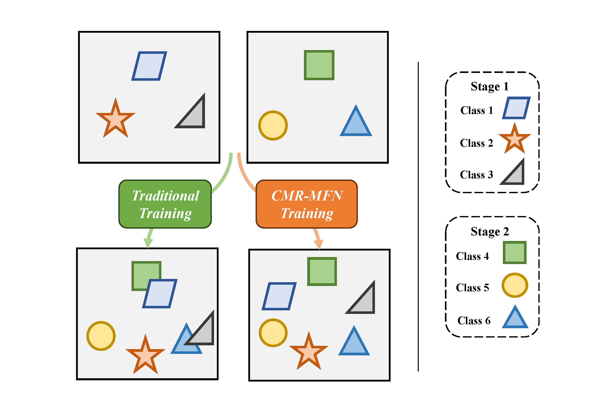
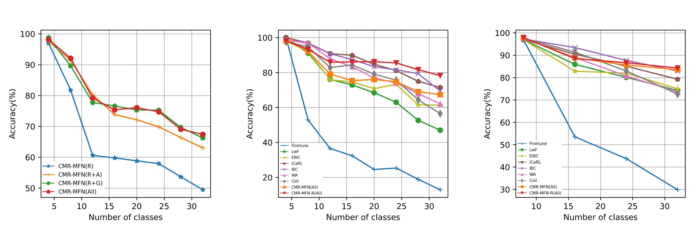

# CMR-MFN
This repository is the implementation for ICCV Workshops 2023 paper "Confusion Mixup Regularized Multimodal Fusion Network for Continual Egocentric Activity Recognition(CMR-MFN)". CMR-MFN introduces a confusion mixup regularized multimodal fusion network that can help alleviate the confusion between the in-stage data and out-stage data in the feature space.



## How to use

### Clone
```
git clone https://github.com/Hanna-W/CMR-MFN.git
cd CMR-MFN
```

### Environment Configuration
Firstly, you should make a new environment with python>=3.6, for example:
```
conda create -n cmr_mfn python=3.8
```
Next, you can download pytorch from official site, for example:
```
pip install torch==1.8.0+cu111 torchvision==0.9.0+cu111 torchaudio==0.8.0 -f https://download.pytorch.org/whl/torch_stable.html
```
Then, run ```pip install -r requirements.txt```  in this repo to install a few more packages.

Lastly, install [Timesformer](https://github.com/facebookresearch/TimeSformer?tab=readme-ov-file) according to its official guide.

### Dataset Preparation 
We evaluate our model on [UESTC-MMEA-CL](https://ivipclab.github.io/publication_uestc-mmea-cl/mmea-cl/), which is the frst multimodal dataset for continual egocentric activity recognition. You can download this dataset from its homepage and put them under the holder ```dataset```. The file structure would look like:
```
CMR-MFN/
|-- backbone/
|-- convs/
|-- dataset/
|   |-- video/
|   |   |-- 1_upstairs/
|   |   |-- ...
|   |   |-- 32_watch_TV/
|   |-- mpu/
|   |   |-- 1_upstairs/
|   |   |-- ...
|   |   |-- 32_watch_TV/
|-- exps/
|-- models/
|-- ops/
|-- utils/
|-- pretrain/
|-- video_records/
|-- main.py
|-- model_T.py
|-- train.txt
|-- test.txt
|-- opts.py
|-- trainer.py
|-- transforms.py
```

### Training and Testing
If you want to train and test CMR-MFN with different modalities, you can run the following example:
```
python main.py UESTC-MMEA-CL RGB --config ./exps/CMR_MFN.json --train_list train.txt --val_list test.txt --num_segments 8 -b 16 --gd 20 -j 8 --device '0' --freeze
```
If you want to train and test CMR-MFN with different modality combinations, you can run the following example:
```
python main.py UESTC-MMEA-CL RGB Accespec Gyrospec --config ./exps/CMR_MFN.json --train_list train.txt --val_list test.txt --mpu_path [your mpu data path] --num_segments 8 -b 16 --gd 20 -j 8 --device '0' --freeze
```
> Note: If you want to train and test acceleration and gyroscope modality, please input your mpu data path and modify the first line of the "_mpu_process" function in [data_manager_T.py](utils\data_manager_T.py)

## Performance


## Citation
If you use any content of this repo for your work, please kindly cite the following paper:
```
@InProceedings{Wang_2023_ICCV,  
    author    = {Wang, Hanxin and Zhou, Shuchang and Wu, Qingbo and Li, Hongliang and Meng, Fanman and Xu, Linfeng and Qiu, Heqian},
    title     = {Confusion Mixup Regularized Multimodal Fusion Network for Continual Egocentric Activity Recognition},
    booktitle = {Proceedings of the IEEE/CVF International Conference on Computer Vision (ICCV) Workshops},
    month     = {October},
    year      = {2023},
    pages     = {3560-3569}
}
```
## Acknowledgments
We thank the following repos providing helpful components/functions in our work.
- [PyCIL](https://github.com/G-U-N/PyCIL/tree/master)
- [TBN](https://github.com/ekazakos/temporal-binding-network/tree/master)
- [Timesformer](https://github.com/facebookresearch/TimeSformer?tab=readme-ov-file)
